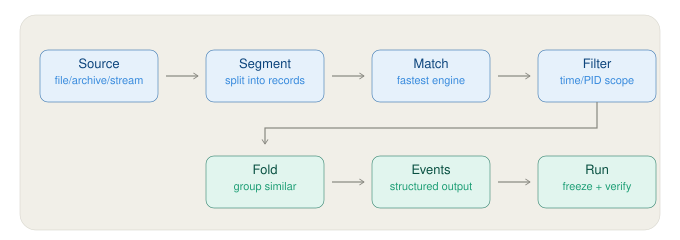

# TraceCite

[English](README.md) | **简体中文**

**面向 AI Agent 的可追溯、可恢复、有界 Evidence Runtime。**

TraceCite 用来让 Coding Agent / Debugging Agent 在大日志、support bundle、trace、crash report 和其他诊断数据上进行调查，而不必把整份原始数据反复塞进模型上下文。

它不替 Agent 推理，也不替 Agent 决定根因。TraceCite 负责的是：**证据获取、不可变身份、Coverage、去重/重放、有界投影、可恢复上下文和引用完整性**；Agent 负责：**假设、因果推理、证据是否足够、最终结论和停止时机**。

> 当前 Agent 验证基线：`feature_for_agent`，已合入验证过的 CA258 实现。包版本仍为 `0.1.0` Alpha。

## 项目简介

典型问题不是“模型不会 grep”，而是：

- 原始日志可能从 MB 到 GB，直接读取会放大上下文和缓存成本；
- 同一证据会被不同 query 重复命中，Agent 会重复消费；
- 多文件、多实体、多时间段的证据容易失去 provenance；
- `no match`、截断、Coverage 缺口很容易被误读为“事情没有发生”；
- Agent 可能已经找到足够证据，却继续做确认性搜索；
- 高压缩检索如果不可恢复，又会牺牲正确性和审计性。

TraceCite 在 Agent 与原始证据之间提供一个确定性的 Evidence Runtime：

```text
Raw Sources
    |
    v
Evidence Core
source/version identity · snapshot · provenance · verify
    |
    v
Evidence Runtime
retrieve · materialize · replay · aggregate · traverse
RetrievalSession · bounded selection · coverage · identity safety
    |
    v
Integration / Host
Pi · Codex · Cursor · CLI · MCP/custom host
    |
    v
Agent
hypothesis · causal reasoning · sufficiency · final answer · stop
```



## 有什么优势

| 能力 | TraceCite 提供什么 | 为什么对 Agent 有用 |
|---|---|---|
| 有界 Evidence | search/retrieve 只把受预算约束的证据送入模型 | 大文件不会因为一次宽泛读取就占满上下文 |
| Provenance | source/version、line/range、SHA-256、Manifest | 最终事实可以回到原始证据复查 |
| Session-aware 去重 | 已见 Evidence 不重复发送 body，同时保留本轮 relevance | 降低跨轮重复上下文，不丢当前 query 的意义 |
| Materialize / Replay | 精确展开或显式重读旧证据 | “去重”不会变成“以后再也看不到” |
| Coverage / uncertainty | truncation、missing evidence、source change、bounded unknown 显式化 | 避免把零命中或局部视图当成全局事实 |
| Identity safety | 机械地约束实体相关性和 correlation key | 避免仅凭相似 ID / 地址 / 文件邻近关系错误串线 |
| Deterministic aggregation/traversal | count/distinct/group 和 caller-scoped traversal | 把机械工作留在 Runtime，不让模型反复做文本搬运 |
| Agent-owned reasoning | Runtime 不输出 root-cause likelihood / stop recommendation | 保持证据层与模型推理层边界清晰，可替换任何 Agent |
| 可恢复压缩 | Canonical Result / Ledger 保留完整恢复路径 | Token 优化不以不可审计为代价 |

## 安装与基础使用

```bash
python -m pip install tracecite

tracecite probe ./logs --glob "*.log" --recursive
tracecite search app.log "timeout|OOM" --regex --snapshot
tracecite expand .tracecite/snapshots/app.log 120 --before 5 --after 10
tracecite verify .tracecite/runs/<run-id>/manifest.json
```

要求 Python 3.10+。当前支持 Linux / macOS；Windows 不在当前支持范围。主包默认没有 Python 标准库之外的运行时依赖。

## Agent 怎么使用

### Pi：当前正式验证方法

仓库中的 Pi A/B 使用 `.pi/skills/tracecite/SKILL.md`，并通过 Pi extension 只暴露 `tracecite_search` / `tracecite_expand`。验证时使用的 bounded system prompt 是：

```text
You are a coding agent investigating supplied runtime evidence. Keep the investigation bounded. Once the root cause is sufficiently supported, answer immediately instead of performing confirmatory searches. Cite exact evidence lines for material factual claims.
```

TraceCite arm 再追加：

```text
Follow the user's explicit request to use TraceCite. All runtime-evidence content must be obtained through TraceCite tools; do not use native file-access tools for the evidence.
```

仓库内可复现实验式调用：

```bash
BASE_PROMPT='You are a coding agent investigating supplied runtime evidence. Keep the investigation bounded. Once the root cause is sufficiently supported, answer immediately instead of performing confirmatory searches. Cite exact evidence lines for material factual claims.'
TRACE_PROMPT="$BASE_PROMPT Follow the user's explicit request to use TraceCite. All runtime-evidence content must be obtained through TraceCite tools; do not use native file-access tools for the evidence."

pi \
  --extension ./benchmarks/agent-investigation/pi_tracecite_extension.ts \
  --tools tracecite_search,tracecite_expand \
  --no-skills --skill ./.pi/skills/tracecite/SKILL.md \
  --no-prompt-templates --no-context-files \
  --system-prompt "$TRACE_PROMPT" \
  "用 tracecite 分析这个问题。${QUESTION}"
```

这里的 extension 路径是当前仓库用于验证的 Pi adapter；`.pi/skills/tracecite/SKILL.md` 才是 Agent 的证据使用/停止契约。生产 Host 可以把相同 canonical Evidence 语义暴露成自己的 tool surface。

### Codex：推荐项目级方法

仓库根目录 `AGENTS.md` 保存必须长期生效的工程边界；TraceCite 调查工作流放在：

```text
.agents/skills/tracecite-investigate/SKILL.md
```

推荐请求：

```text
Use $tracecite-investigate to investigate <problem> from the supplied evidence.
Keep retrieval bounded. Cite exact materialized evidence for material factual claims.
Do not fill evidence gaps with external knowledge; qualify unsupported parts explicitly.
```

Codex 可以直接通过 shell 调用 TraceCite CLI。对于大输入，推荐：

```bash
tracecite probe ./logs --glob "*.log" --recursive
tracecite search app.log "<discriminator>" --snapshot \
  --agent-profile stateful-index \
  --ledger-dir .tracecite/ledger \
  --context-id incident-42

tracecite expand-many .tracecite/ledger RESULT_ID '#L120' '#L188-L190'
```

规则是：**先提出一个会改变当前判断的 discriminator，再取最小证据；已经闭合的事实不要为了“更确认”重新搜索。**

### Cursor：推荐 Project Rule 方法

仓库提供：

```text
.cursor/rules/tracecite-investigation.mdc
```

它是项目级、版本控制的 Cursor Rule。对日志/trace/support bundle/root-cause 调查时让 Cursor 按 relevance 应用该 Rule，或者在 Agent 中手动引用它。Cursor 仍通过 shell 使用同一套 TraceCite CLI，不创建另一套 Evidence 语义。

推荐请求：

```text
Use the TraceCite investigation rule for this incident.
Investigate only from the supplied evidence, keep retrieval bounded,
and cite exact evidence ranges for the causal claims in the final answer.
```

Pi、Codex、Cursor 的差异只在 Host/Prompt/Tool adapter；**Evidence、Coverage、Provenance、RetrievalSession 和恢复语义保持一致**。完整说明见 [Agent integration](docs/agent-integration.zh-CN.md)。

## 对比数据

下面都是相同模型条件下的 Native vs TraceCite paired A/B 实测；这些数字用于说明已观察到的行为，不是对所有项目/模型的固定节省承诺。

### 4 个公开 root-cause case，双重复

Case：containerd #6772 + 3 个 Kubernetes case；Pi bounded prompt；MiniMax M3；共 8 个 paired outputs。

| 指标 | Native | TraceCite | TraceCite 变化 |
|---|---:|---:|---:|
| Pass | 6 / 8 | 6 / 8 | 持平 |
| Concept recall | 78.1% | 87.5% | +9.4 pp |
| Evidence marker recall | 93.8% | 90.6% | -3.1 pp |
| Input tokens | 543,333 | 341,232 | **-37.2%** |
| Output tokens | 89,533 | 52,644 | **-41.2%** |
| Cache-read tokens | 23,973,873 | 5,991,938 | **-75.0%** |
| Model calls | 530 | 195 | **-63.2%** |
| Tool calls | 477 | 357 | **-25.2%** |
| Input + output + cache | 24,606,739 | 6,385,814 | **-74.0%** |

对应 workflow run：`33620265562`。

### MB 级真实公开 evidence，双重复

Longhorn #7843（模型可见原始 evidence 约 17.8 MB）+ Harvester #6253（约 7.7 MB）；严格使用 CA258 Agent/Skill/Runtime 基线，只增加 benchmark case/workflow；MiniMax M3；共 4 个 paired outputs。

| 指标 | Native | TraceCite | TraceCite 变化 |
|---|---:|---:|---:|
| Pass | 2 / 4 | 2 / 4 | 持平 |
| Concept recall | 87.5% | 87.5% | 持平 |
| Evidence marker recall | 75.0% | 75.0% | 持平 |
| Input tokens | 494,553 | 289,824 | **-41.4%** |
| Output tokens | 32,836 | 34,194 | +4.1% |
| Cache-read tokens | 13,193,560 | 3,078,682 | **-76.7%** |
| Model calls | 276 | 83 | **-69.9%** |
| Tool calls | 193 | 196 | +1.6% |
| Input + output | 527,389 | 324,018 | **-38.6%** |
| Input + output + cache | 13,720,949 | 3,402,700 | **-75.2%** |

对应 workflow run：`33638574962`。

质量数字保留 benchmark scorer 的原始结果。人工复查发现 Longhorn gmi1 的一条 TraceCite 答案用“old Unpublish happens after new Publish”表达了与 gold 等价的时序，但 regex scorer 未识别反向措辞，因此表格没有人工改分。详细数据、有效性规则和 caveat 见 [Benchmark results](docs/benchmark-results.zh-CN.md)。

## 整体架构

TraceCite 的最高级边界只有一句：

> **Agent 负责想和决定；TraceCite 负责证据。**

```text
                         Domain Extensions
                     Mobile / CI / third-party
                               |
                               v
Raw source -> Evidence Core -> Evidence Runtime -> Integrations -> Agent Host
              |                 |                 |              |
              |                 |                 |              +-- Pi
              |                 |                 |              +-- Codex
              |                 |                 |              +-- Cursor
              |                 |                 |              +-- MCP/custom
              |                 |                 |
              |                 |                 +-- projection / ledger / context
              |                 |
              |                 +-- RetrievalSession
              |                 +-- bounded evidence selection
              |                 +-- identity/correlation safety
              |                 +-- aggregate / traverse
              |                 +-- optional InvestigationState
              |
              +-- source/version identity
              +-- snapshot / provenance / manifest / verify

Agent owns: hypothesis -> causal reasoning -> sufficiency -> answer -> stop
```

### Canonical Evidence API

长期语义收敛到六类机械原语：

- `retrieve`：caller 选择 scope/predicate，Runtime 返回 Evidence + Coverage + Provenance + novelty。
- `materialize`：精确展开不可变 Evidence/range。
- `replay`：有意重读已见 Evidence，不把它伪装成新 Evidence。
- `aggregate`：确定性的 count / distinct / group 等统计。
- `traverse`：在 caller 指定 seed/scope/limit 下做机械遍历。
- `verify`：验证 source/version、Manifest、Evidence 完整性等机械事实。

`search` / `expand` / `expand-many` 等 CLI/adapter 是便利表面，不拥有一套独立的因果或 stopping 语义。

详细架构见 [docs/architecture.zh-CN.md](docs/architecture.zh-CN.md)。

## 文档

当前文档入口见 [docs/README.md](docs/README.md)。其中：

- `architecture*.md`：当前规范架构。
- `agent-integration*.md`：Pi / Codex / Cursor / CLI / Host 接入。
- `benchmark-results*.md`：当前正式 Agent A/B 数据。
- `context-engine*.md`：跨轮 Evidence delta 与恢复。
- `extension-contract.md`：领域扩展契约。
- `knowledge-governance*.md`：Knowledge 生命周期。
- `adr/`、`migrations/`：历史决策/迁移记录，按历史语义保留，不作为当前状态页。

## License

MIT
